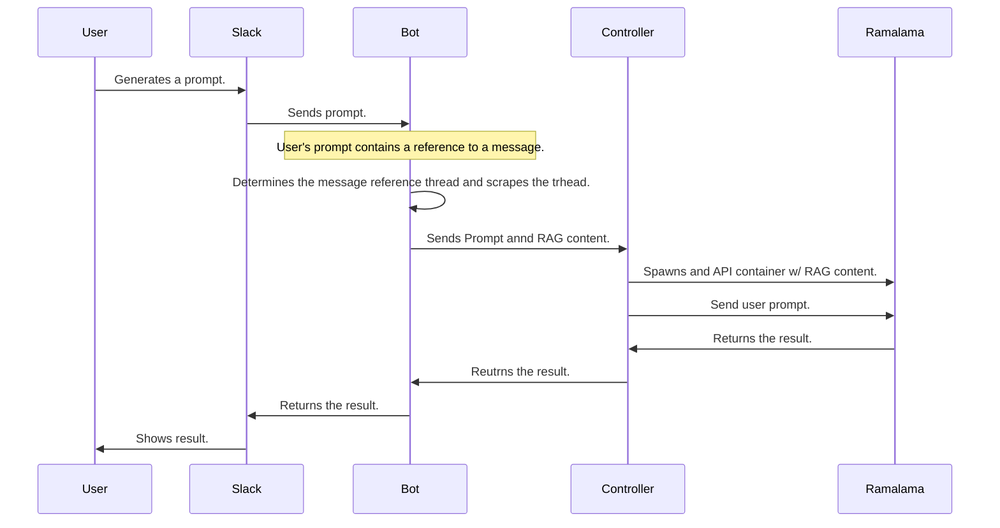

# Dramalama
A self hosted, RAG assisted, distributed information retrieval system enabling secure chatbot like integrations with your Slack environment.

## How It Works

```mermaid
sequenceDiagram

    participant User
    participant Slack
    participant Bot
    participant Controller
    participant r as Ramalama

    User ->> Slack: Generates a prompt.
    Slack ->> Bot: Sends prompt.
    note over Bot: User's prompt contains a reference to a message.
    Bot ->> Bot: Determines the message reference thread and scrapes the trhead.
    Bot ->> Controller: Sends Prompt annd RAG content.
    Controller ->> r: Spawns and API container w/ RAG content.
    Controller ->> r: Send user prompt.
    r ->> Controller: Returns the result.
    Controller ->> Bot: Reutrns the result.
    Bot ->> Slack: Returns the result.
    Slack ->> User: Shows result.
```
